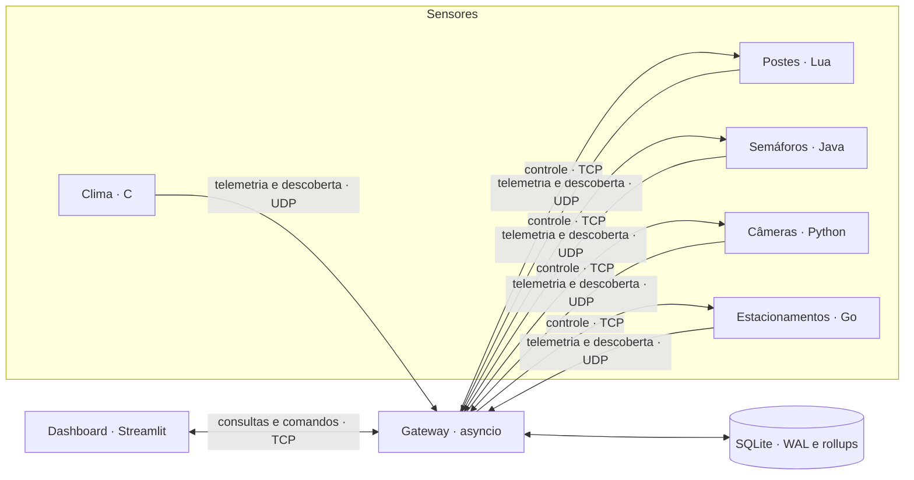

# Smart City — Distributed Urban Monitoring

[](https://github.com/lucas-ferre/projeto_socket/actions/workflows/ci.yml)

Laboratório distribuído de **telemetria, descoberta, controle remoto e análise de
dados urbanos**. Cinco implementações de sensores — C, Lua, Java, Python e Go —
compartilham um contrato Protocol Buffers e se comunicam com um gateway assíncrono
central. Os dados são persistidos no SQLite e explorados em um dashboard Streamlit.

> **Status:** projeto acadêmico e de portfólio para execução local. A arquitetura
> demonstra integração e resiliência, mas ainda não oferece autenticação nem
> criptografia suficientes para uso em uma rede não confiável.


## Por que este projeto é relevante

- integra uma frota poliglota por meio de um único contrato Protobuf;
- separa telemetria e descoberta por UDP do controle e das consultas por TCP;
- aplica concorrência com `asyncio`, goroutines, threads POSIX/JVM/Python e loop Lua;
- implementa framing binário, idempotência, backpressure, retry com jitter e heartbeat;
- mantém séries históricas no SQLite com WAL, ledger transacional, retenção e rollups;
- limita janelas e pontos de consultas OLAP antes de enviar dados ao dashboard;
- oferece operação individual de dispositivos e feedback explícito dos comandos;
- automatiza validação, testes, builds e smoke test no GitHub Actions.

## Arquitetura



O gateway é a única fronteira de persistência e coordenação. O endereço anunciado
por um sensor é tratado como dado não confiável; para controle, o gateway utiliza o
IP de origem observado no datagrama de descoberta.

O ledger `(device_id, message_id)` e o checkpoint de ordem por dispositivo são
confirmados junto com métricas e rollups, evitando duplicação após retransmissões
ou reinicializações. O worker repete lotes quando a escrita falha. Os IDs expiram
somente se `MESSAGE_MAX_AGE_SECS > 0`; com zero, permanecem no ledger.

| Serviço | Runtime | Dispositivos padrão | Domínio | Controle |
|---|---|---:|---|---:|
| `sensor_clima` | C | 6 | clima e qualidade ambiental | — |
| `sensor_posto` | Lua | 3 | luminosidade e consumo | `5006/TCP` |
| `sensor_java` | Java 21 | 3 | fluxo e fila veicular | `5003/TCP` |
| `sensor_camera` | Python 3.11 | 3 | tráfego e infrações | `5004/TCP` |
| `sensor_estacionamento` | Go 1.23 | 3 | ocupação e rotatividade de vagas | `5007/TCP` |

As portas de controle permanecem apenas na rede interna do Compose. No host, o
dashboard e as interfaces do gateway são publicados em `127.0.0.1` por padrão.

## Novo sensor: estacionamento inteligente em Go

O nó Go simula os estacionamentos **Centro**, **Campus** e **Hospital**. Cada
dispositivo pode ser ligado, desligado ou ter sua frequência alterada de 1 a 60
segundos, sem afetar os demais dispositivos do mesmo processo.

Métricas publicadas:

- `total_spaces`, `occupied_spaces` e `available_spaces`;
- `occupancy_rate` em percentual;
- `vehicle_turnover` em veículos por minuto.

A simulação preserva a invariante
`occupied_spaces + available_spaces = total_spaces`. O servidor de controle possui
limite de clientes, deadline por conexão, validação temporal, rejeição de replay e
encerramento gracioso. Veja a [implementação](projeto-sockets/sensor_go/main.go) e os
[testes](projeto-sockets/sensor_go/main_test.go).

## Início rápido

Pré-requisitos: Docker Engine com Compose v2 ou uma configuração compatível do
Podman. Não é necessário instalar os cinco runtimes no host.

```bash
git clone https://github.com/lucas-ferre/projeto_socket.git
cd projeto_socket/projeto-sockets
docker compose config --quiet
docker compose up --build --detach --wait
```

Abra <http://127.0.0.1:8501>. Para acompanhar ou encerrar o laboratório:

```bash
docker compose ps
docker compose logs --follow gateway dashboard sensor_estacionamento
docker compose down
```

O volume `gateway_db` preserva o histórico. Para remover também os dados simulados,
use conscientemente `docker compose down --volumes`.

Em `SIGTERM`/`SIGINT`, o gateway para de admitir entradas e tenta drenar a fila
antes de fechar o banco. O prazo padrão é 20 segundos
(`TELEMETRY_SHUTDOWN_TIMEOUT_SECS`), com 45 segundos de tolerância no Compose.
Prazo excedido ou falha final de escrita geram erro no log e podem perder pacotes
que ainda estavam em memória.

### Configuração

```bash
cp .env.example .env
```

No PowerShell:

```powershell
Copy-Item .env.example .env
```

As quantidades de dispositivos, os limites de entrada e a janela analítica podem
ser alterados no `.env`. Mantenha `BIND_ADDRESS=127.0.0.1` durante o desenvolvimento.
A referência completa está em [Operações](docs/operations.md).

## Dashboard

O cliente oferece quatro fluxos:

1. **Fontes de dados:** inventário e presença da frota descoberta;
2. **Painel de atuação:** status e frequência por dispositivo controlável;
3. **Consultas analíticas:** média, desvio-padrão e variação máxima por intervalo;
4. **Inspeção individual:** série temporal e eventos de um dispositivo.

Toda requisição recebe identificador e timestamp. Comandos inválidos são recusados
antes da mutação, e consultas excessivas são limitadas a 30 dias e 2.000 pontos por
padrão.

O gateway devolve o `message_id` da requisição para correlação no cliente e confere
o ID, estado e frequência das confirmações de atuação. A fonte OLAP considera
duração e retenção do período consultado; buckets das bordas podem ampliar a
janela, explicitada nos metadados do resultado.

## Validação

As regressões de gateway, dashboard e sensor Python usam banco temporário e
sockets locais. Prepare um ambiente Python com `protoc` disponível; os comandos
abaixo partem da raiz do repositório:

```bash
cd projeto-sockets
python -m pip install -r gateway/requirements.txt -r client/requirements.txt -r sensor_python/requirements.txt
protoc -I=common --python_out=gateway common/messages.proto
protoc -I=common --python_out=client common/messages.proto
protoc -I=common --python_out=sensor_python common/messages.proto
python -m unittest discover -s tests -v
python -m unittest discover -s sensor_python -p 'test_*.py' -v
```

O teste C do AQI e detalhes da preparação estão em [Operações](docs/operations.md#validação-e-testes)
e [Setup](SETUP.md#5-validações-antes-de-uma-contribuição).

O sensor Go é validado com:

```bash
cd projeto-sockets/sensor_go
go mod verify
go vet ./...
go test ./...
```

O build da imagem também executa `go test -race -mod=readonly ./...`. O workflow de
CI valida o Compose, compila os módulos Python, executa os testes, constrói os sete
serviços e realiza um smoke test no endpoint de saúde do dashboard. A preparação
gera os bindings Python nos três diretórios e instala seus manifestos; o teste C
do AQI também é executado no CI.

## Documentação

| Documento | Conteúdo |
|---|---|
| [Índice técnico](docs/README.md) | mapa do código e fontes de verdade |
| [Arquitetura](docs/architecture.md) | componentes, fluxos, concorrência e persistência |
| [Protocolo](docs/protocol.md) | mensagens, framing, portas, validações e evolução |
| [Operações](docs/operations.md) | configuração, observabilidade, testes e diagnóstico |
| [Setup](SETUP.md) | preparação detalhada do ambiente |
| [Segurança](SECURITY.md) | modelo de ameaça e limites conhecidos |
| [Contribuição](CONTRIBUTING.md) | critérios para mudanças verificáveis |

## Estrutura

```text
.
├── .github/workflows/ci.yml
├── docs/
├── CONTRIBUTING.md
├── SECURITY.md
├── SETUP.md
└── projeto-sockets/
    ├── common/messages.proto
    ├── gateway/
    ├── client/
    ├── sensor_c/
    ├── sensor_lua/
    ├── sensor_java/
    ├── sensor_python/
    ├── sensor_go/
    ├── tests/
    └── docker-compose.yml
```

## Escopo de segurança

O projeto possui limites de frame e datagrama, validação de enums, campos, métricas
e timestamps, deduplicação, proteção contra replay local e publicação de portas no
loopback. Ainda assim, UDP e TCP não são autenticados nem criptografados. Não exponha
o laboratório diretamente à Internet. Para evolução além do ambiente acadêmico,
consulte [SECURITY.md](SECURITY.md).

## Decisões mantidas em aberto

Conforme o planejamento do projeto, duas decisões serão tomadas após esta rodada:

- **ponto 1 — estratégia definitiva de build:** manter Dockerfiles por serviço,
  consolidar o fallback ou adotar outra organização;
- **ponto 9 — licença:** escolher a licença compatível com o objetivo do portfólio.

Até a escolha do ponto 9, a ausência de um arquivo `LICENSE` significa que não há
uma permissão aberta de reutilização concedida pelo repositório.
