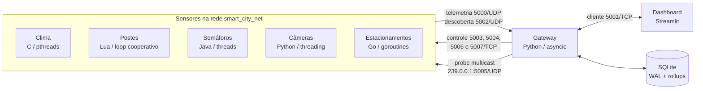

# Arquitetura

[Documentação](README.md) · [Protocolo](protocol.md) · [Operações](operations.md)

## Visão geral

O sistema simula uma infraestrutura urbana distribuída em uma rede Docker
Compose. Ele adota o modelo **hub-and-spoke**: sensores poliglotas não se
comunicam entre si; todos registram presença e enviam telemetria ao gateway, que
centraliza persistência, controle e consultas analíticas.

As portas do gateway e do dashboard são publicadas em `127.0.0.1` por padrão.
As portas de controle dos sensores permanecem internas à rede Compose.

## Componentes

| Componente | Implementação | Modelo de concorrência | Responsabilidade | Controle |
|---|---|---|---|---|
| `gateway` | Python 3.11 | `asyncio`, fila limitada e pool SQLite | Ingestão, descoberta, presença, proxy de comandos e OLAP | Cliente em 5001/TCP |
| `dashboard` | Python 3.11 + Streamlit | Sessão web e cliente TCP persistente | Inventário, atuação, gráficos e inspeção | — |
| `sensor_clima` | C11/POSIX | `pthreads` | Clima e qualidade do ar | Não controlável |
| `sensor_posto` | Lua 5.4 | Agendamento cooperativo | Iluminação e consumo elétrico | 5006/TCP |
| `sensor_semaforo` | Java 21 | Threads e interrupção cooperativa | Estado e fila de tráfego | 5003/TCP |
| `sensor_camera` | Python 3.11 | `threading` e evento de encerramento | Fluxo e infrações de trânsito | 5004/TCP |
| `sensor_estacionamento` | Go 1.23 | Goroutines, `context` e estado protegido por mutex | Ocupação e rotatividade de vagas | 5007/TCP |

Todos usam o mesmo contrato em
[`common/messages.proto`](../projeto-sockets/common/messages.proto). O sensor Go
é registrado como `DEVICE_TYPE_PARKING_SENSOR` (`6`) e simula dispositivos nos
setores Centro, Campus e Hospital.

## Fluxos principais

### Registro e presença

1. No boot, cada sensor envia um `DiscoveryResponse` para `gateway:5002/UDP`.
2. O gateway valida o envelope, considera o endereço de origem observado no UDP
   e faz UPSERT do dispositivo no SQLite.
3. O sensor renova a presença periodicamente por heartbeat.
4. O gateway marca como `STATUS_OFF` dispositivos cujo `last_seen` exceda o
   limite configurado.
5. Após reiniciar, o gateway envia probes para `239.0.0.1:5005/UDP`; os sensores
   respondem novamente com `DiscoveryResponse`.

IDs de dispositivo são estáveis. Reiniciar um container atualiza o registro
existente, em vez de gerar uma nova identidade.

### Telemetria

1. Um dispositivo produz um `DataPayload` serializado em Protobuf.
2. O sensor transmite o datagrama para `gateway:5000/UDP`, com retry e jitter.
3. O gateway aplica limites de tamanho, campos, timestamp, enumerações e valores.
4. Mensagens duplicadas ou atrasadas são descartadas.
5. Payloads válidos entram em uma fila assíncrona limitada.
6. O consumidor persiste lotes e atualiza os rollups no mesmo ciclo de escrita.

Quando a fila está cheia, o gateway descarta o novo datagrama e contabiliza o
evento; ele não cria uma quantidade ilimitada de tasks aguardando espaço. Essa
backpressure mantém o consumo de memória previsível sob rajadas.

### Controle remoto

1. O dashboard cria um `ClientRequest` de tipo `SEND_COMMAND` e o envia ao
   gateway em um frame TCP.
2. O gateway valida envelope, alvo e `ConfigCommand` antes de consultar o
   cadastro do dispositivo.
3. Para um sensor controlável, o gateway abre a porta TCP registrada e encaminha
   o comando com framing idêntico.
4. O nó aplica a alteração ao dispositivo virtual solicitado e devolve um
   `ConfigResponse`.
5. O gateway repassa o resultado ao dashboard.

Os comandos disponíveis alteram somente o estado (`STATUS_ON` ou `STATUS_OFF`)
e/ou a frequência de telemetria, limitada ao intervalo de 1 a 60 segundos. O
sensor climático em C não participa desse fluxo.

### Consulta analítica

1. O dashboard envia métrica, operação, janela temporal e alvo opcional.
2. O gateway limita a janela e escolhe a fonte de menor granularidade adequada.
3. A agregação é calculada em SQLite e a série de gráfico é amostrada quando
   necessário.
4. O resultado escalar, os metadados e até um número limitado de pontos retornam
   em `ClientResponse`.

As operações suportadas são média, desvio-padrão amostral e maior variação. A
seleção padrão de fonte é:

| Janela | Fonte |
|---|---|
| Até 1 hora | `metrics` (eventos brutos) |
| Até 24 horas | `metrics_rollup_1m` |
| Até 7 dias | `metrics_rollup_5m` |
| Acima de 7 dias | `metrics_rollup_1h` |

A janela total aceita é limitada a 30 dias e a resposta gráfica a 2.000 pontos
por padrão. Os limites são configuráveis e estão descritos em
[Operações](operations.md#consultas-e-retenção).

## Concorrência e isolamento

O projeto usa uma estratégia adequada a cada runtime, mas preserva as mesmas
responsabilidades lógicas:

- **gateway:** protocolos UDP não bloqueantes, servidor TCP assíncrono, tasks de
  descoberta limitadas, um consumidor de telemetria em lote e pool de conexões;
- **C:** threads separam telemetria, heartbeat e recuperação multicast;
- **Lua:** um loop cooperativo agenda I/O e retransmissões sem bloquear o ciclo
  principal;
- **Java:** loops de telemetria e controle são interrompidos durante o shutdown;
- **Python:** threads coordenadas por um evento compartilham o estado protegido;
- **Go:** goroutines de telemetria, heartbeat, multicast e controle são
  canceladas por `context`; mutexes protegem frota e comandos recentes.

Cada processo sensor pode representar vários dispositivos virtuais. O estado e
a frequência são mantidos por `device_id`, de modo que um comando não altera os
demais dispositivos do mesmo container.

## Persistência

O gateway usa SQLite em modo WAL e mantém quatro níveis de dados:

| Tabela | Granularidade | Finalidade |
|---|---:|---|
| `metrics` | Evento | Inspeção e janelas curtas |
| `metrics_rollup_1m` | 60 s | Consultas intermediárias |
| `metrics_rollup_5m` | 300 s | Consultas longas |
| `metrics_rollup_1h` | 3.600 s | Histórico consolidado |

Cada rollup armazena contagem, soma, soma dos quadrados, mínimo e máximo. Isso
permite combinar buckets e calcular estatísticas sem materializar toda a série
bruta. As funções determinísticas de bucketização, desvio-padrão, seleção de
fonte e amostragem estão isoladas em
[`gateway/analytics.py`](../projeto-sockets/gateway/analytics.py) e possuem testes
unitários.

O volume `gateway_db` preserva o banco entre reinicializações normais do Compose.
A remoção explícita de volumes elimina esse histórico.

## Resiliência

- retry UDP/DNS com backoff exponencial e jitter nos sensores;
- jitter de telemetria para evitar rajadas sincronizadas;
- heartbeat de descoberta e recuperação multicast após reinício do gateway;
- fila e concorrência limitadas nas fronteiras de entrada;
- timeouts e tamanho máximo para frames TCP;
- healthchecks do gateway, dashboard e sensores controláveis;
- graceful shutdown para descarregar buffers e fechar listeners;
- SQLite WAL, pool de conexões, checkpoint e políticas de retenção.

UDP continua sendo um transporte sem confirmação de entrega. Os mecanismos
reduzem perda e indisponibilidade, mas não oferecem entrega exatamente uma vez.

## Fronteiras de confiança

O laboratório não implementa autenticação, autorização por identidade, TLS ou
assinatura de datagramas. Validação estrutural, limites e bind local reduzem a
superfície de falhas, mas não tornam a topologia apropriada para uma rede não
confiável. Consulte a [política de segurança](../SECURITY.md) antes de alterar
`BIND_ADDRESS` ou publicar portas internas.

